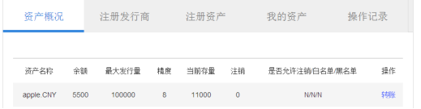
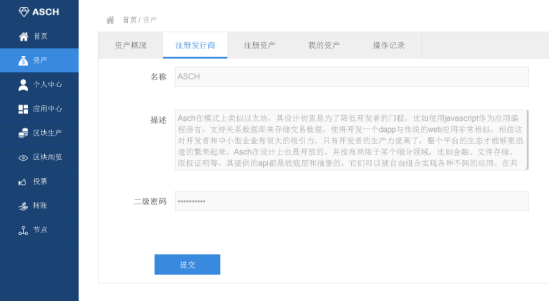
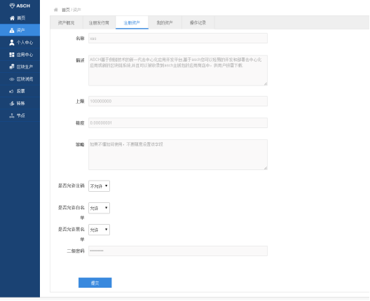
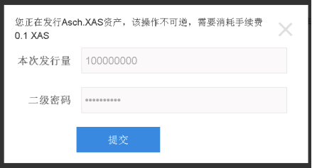
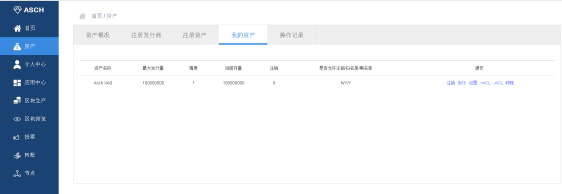
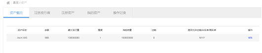
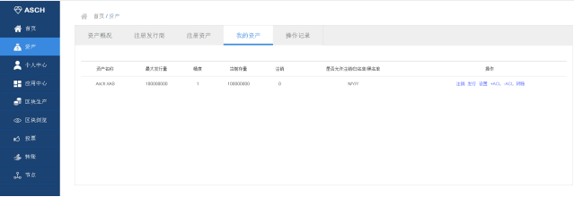
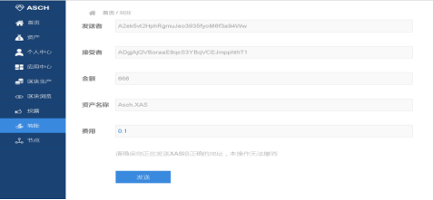
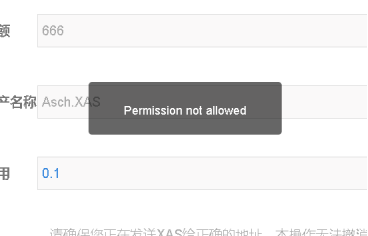
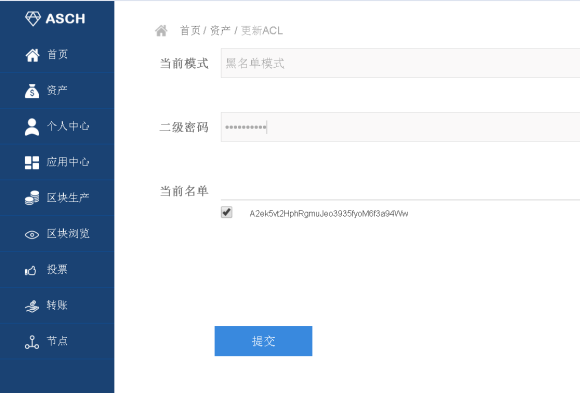

title:  ASCH 发行资产文档
---

Asch钱包升级1.2后增加了“发行资产”和“存储”功能,本篇文档将详细介绍如何在Asch中发行资产。 
发行资产要求
Ø 钱包版本1.2.7及以上
Ø 钱包内至少有605.1 xas（如果已注册过Asch钱包并且已设置二级密码，则只需要600.1 xas）

发行资产方法
# 1 注册Asch钱包并设置而二级密码，设置二级密码需支付5 xas（如已有钱包且设置二级密码请忽略此步骤）
注册方法：[注册方法](http://bbs.asch.so/topic/21/%E5%B0%8F%E7%99%BD%E7%8E%A9%E8%BD%ACasch%E8%B4%A6%E6%88%B7%E5%BF%85%E7%9C%8B)
（备注：[钱包用户须知](http://bbs.asch.so/topic/23/%E9%92%B1%E5%8C%85%E7%94%A8%E6%88%B7%E9%A1%BB%E7%9F%A5)）

# 2 点击左侧“资产”选项，进入发行资产内容相关页面，默认显示资产概览，这里能看到全部拥有的UIA（用户发行资产）资产概况，不一定是自己发行的。

# 3  点击“注册发行商”，输入资产发行商的名称，发行商和发行资产的描述，输入在步骤1中设置好的二级密码，点击“提交”。注册发行商需支付100XAS。
填写说明：
发行商：16位以内的大写英文字母，不能包含其它字符。
描述：这里最多可以写2000汉字的描述，建议将发行商信息写的清楚一些，比如公司简介、发行资产的目的、资产的简单规划等等，让人看到能一目了然。

# 4 注册发行商信息提交后，点击“注册资产”，填写相关注册信息，完成填写后，点击“提交”（注意：必须先注册发行商才能注册资产）。
填写说明：
名称：资产名字。最终的资产在Asch链上展现为“发行商名字.资产名字”
描述：最多输入2000汉字，建议描述清楚。
精度：1~16之间的数字，代表小数点后的位数，一般建议填写8。方便以后单位换算，参考btc的聪，0.00000001为1聪。
策略：高级功能，可以实现诸如定期解锁之类的功能，如果有需求，请咨询Asch研发人员，勿擅自填写。没有该项需求，请留空。举例：初始发行10万，每年减半的代码为“quantity < 100000 * (2 - 1 / 2 ^((height - genesisHeight) / 8640 / 365))”
是否允许注销：默认不允许。防止发行人恶意注销资产，使他人蒙受损失。当然有些资产最后就是需要注销的，则此时可以选则“允许”。资产注销后便不可以再进行转账，但不会消失，仍然可以查看，只是状态是“注销”。
是否允许白名单：默认不允许。“允许”代表资产发行后可以创建白名单（将用户的Asch地址加入到名单中即可），比如只想让该资产在某些人之间流通，则白名单可以满足。不允许的话则资产创建后不支持白名单功能。
是否运行黑名单：默认不允许。“允许”代表资产发行后可创建黑名单（将用户的Asch地址加入到名单中即可），比如不想让某些人持有该资产，则黑名单可以满足。不允许的话则资产创建后不支持黑名单功能。

# 5 提交注册资产信息后，点击“我的资产”，选择“发行”，设置本次发行量（本次教程中发行量设置为全部发行，也可先发行部分资产），发行资产需支付500 xas和0.1 xas的手续费，其中500 xas平均非配给前101名受托人。发行的意思：使这部分资产变得可以流通（资产转账），新发行资产数+当前存量<=最大发行量。

# 6 发行成功，即可在“我的资产”中发行的资产信息，并进行相关操作。

当前存量：代表当前已发行（可转账）的资产数量，该值<=最大发行量
注销：当前该资产是否注销，0代表未注销，1代表已注销。
“操作”中的设置：用来修改资产的访问控制列表（ACL）是使用白名单还是黑名单模式。修改的前提是资产发行时允许创建黑、白、黑白名单，否则会提示失败。资产创建后默认为黑名单模式。

# 7 发行资产即可进行转账交易、设置黑白名单、注销资产等。
1) 转账交易
点击“资产概况”（包含所有拥有的资产）或“我的资产”（仅包含我注册的资产），均可进行转账操作，转账数量不能超过发行量。
注意，切勿使用左侧的“转账”选项，左侧是对Asch主链默认资产（代币）XAS的转账，而不是对用户发行的资产进行转账。

2) 点击“我的资产”，选择“+ACL”为ACL名单（具体是黑名单还是白名单，取决于“设置”中的值）增加条目（地址）、“-ACL” 为ACL名单删除条目（地址）
若此时ACL为黑名单模式， A账户发行了X资产，X设置为黑名单模式，通过“+ACL”将B账户加入到列表中，则B账户无法转入或者转出X资

-ACL取消黑名单，将B账户从X资产的黑名单中取消，则B账户可以转入或者转成X资产。

3) 注销资产
打开“我的资产”点击“注销”，可注销已发行的资产，前提是资产发行时设置了“允许注销”，否则会注销失败。手续费0.1 XAS，注销的资产不可恢复但仍然会显示在页面上。

综上，介绍Asch发行资产的使用方法，随后续版本更新持续完善。
