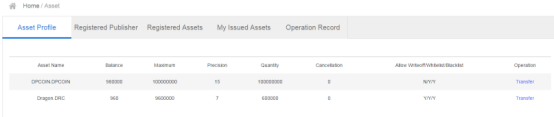
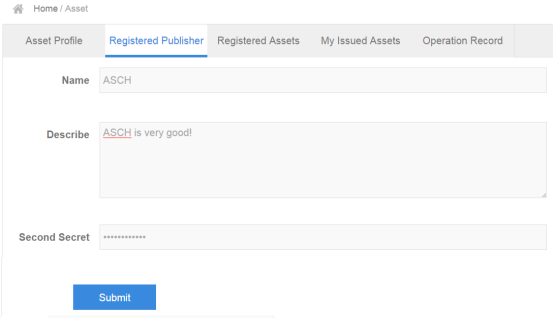
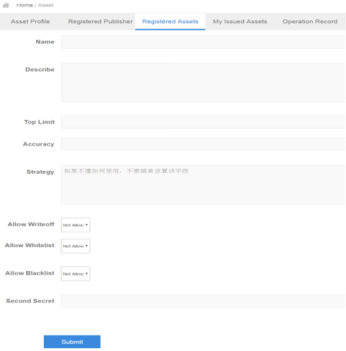
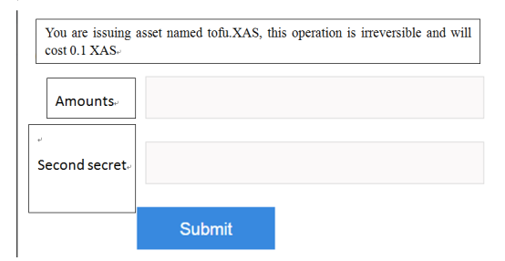
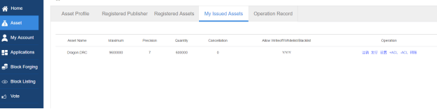
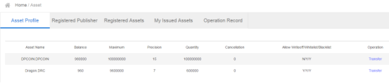
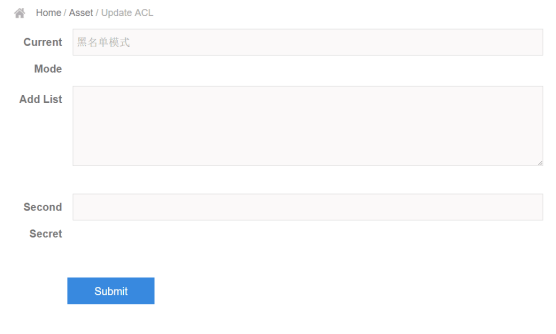

title:  ASCH issue assets
---

After the ASCH wallet upgrading to Version 1.2, two new features have been added: Issue Asset and Store. This article will introduce how to issue your asset on the Asch.
Requirements for issuing asset:
Ø Wallet version 1.2.7 and above;
Ø 2)At least 605.1 xas in the wallet (For registered Asch wallet account with second password already set, the number is 600.1 xas)

Steps to issue asset:
# 1 Register an ASCH wallet account and set the second password, you need to pay 5 xas for setting the second password. If you have done this before, skip to step 2.
[To register an ASCH wallet account](http://bbs.asch.so/topic/21/%E5%B0%8F%E7%99%BD%E7%8E%A9%E8%BD%ACasch%E8%B4%A6%E6%88%B7%E5%BF%85%E7%9C%8B)
(Note: [Guide for wallet user](http://bbs.asch.so/topic/23/%E9%92%B1%E5%8C%85%E7%94%A8%E6%88%B7%E9%A1%BB%E7%9F%A5))

# 2 Click the “Asset” tab, the asset profile will show on the right. Here, you can see the summary of all the UIA (User Issued Asset), maybe not all of the assets are issued by yourself.

# 3  Click the “Registered Publisher” tab, input the name and the description of a publisher in the first and second boxes, then input the second password set in step 1 in the third box. Click “Submit” to finish this step. 100 xas is needed for registration.

Instructions of the fields:
Name: no more than 16 English letters, case sensitive, no other characters.
Describe: no more 2000 characters, it is better to provide some detail information such as introduction of the company, the purpose and simple roadmap of the issued assets and so on.

# 4 After submitting the registration information, click the “Registered Assets” tab, fill in the fields in this page and click “Submit”. (Note: you should register the publisher first).
Instructions of the fields:
Name: Asset name. The final asset will show on the ASCH chain in this form “Publisher name.Asset name”.
Describe: no more 2000 characters, it is better to provide some detail information.
Top limit:
Accuracy: a number between 1 to 16, which is the digit(s) after the decimal point. 8 is a typical number. For example, similar to the Satoshi of BTC, 1 Satoshi= 0.00000001 BTC.
Strategy: Advanced function used for some advanced features such as “Unlock on a regular basis”. When necessary, ask for Asch development team for help, DO not fill in this field without authorization. When not necessary, leave it blank. For example, initial issued asset is 100k, then decreases 50% every year, the code is “quantity < 100000 * (2 - 1 / 2 ^((height - genesisHeight) / 8640 / 365))”
Allow Writeoff: In order to prevent issuers from writing off the asset maliciously and making others lost, “not allow” is the default option. In some cases, the assets should be written off, then you can choose “allow”. After writing off the assets, you cannot transfer but you can view the asset with the status of “Write off”.
Allow Whitelist: “not allow” is the default option. “allow” means you can create a whitelist (Add the Asch addresses of the users to the list), for example, if you want to limit the assets circulated between some users, you can use the whitelist. If you choose “not allow”, then whitelist feature will not be supported after creating asset.
Allow Blacklist: “not allow” is the default option. “allow” means you can create a blacklist (Add the Asch addresses of the users to the list), for example, if you do not want some users to hold the assets, you can use the blacklist. If you choose “not allow”, then blacklist feature will not be supported after creating asset.

# 5 After submitting the information of the Registered Assets, click the “My Issued Assets”, select “Issue”, On the dialogue, fill in the Issue Volume (the issue volume in this guide is set as the whole volume) and the Second password. You need to pay 500.1 xas, in which, 500 xas will be distributed to 101 delegates equally, and 0.1 xas is the fee. The “issue” means this volume of assets will be circulated, and new issued volume + current left volume <= maximum volume.

# 6 Then, you can see the asset profile in “My Issued Asset” tab. Current Volume: amount of issued assets, this value should be less than the maximum issued volume. Cancellation: 0 represents not cancelled, 1 represents cancelled.
Settings under the “Operation”: Used to modify the access control list (ACL) to be whitelist or blacklist mode. The precondition is you have set “allow” to create a blacklist, whitelist or both of them, or you will be promoted failure. The default set is blacklist mode.

# 7 After issuing assets, you are able to transfer assets, set blacklist or whitelist, and cancel assets.
1) Transfer assets
Click “Asset Profile” tab (including all your assets) or “My Issued Assets” tab (including your issued assets only), you can transfer you assets to others, and the transfer amount should not exceed the issued volume.
Note: DO NOT use the “transfer” tab on the left side, it is used for transferring Asch main chain asset (XAS assets), not for your issued asset.

2) Set blacklist or whitelist
Click the “My Issued Assets” tab, choose “+ACL” to add items (addresses) to the ACL list (whether it is a whitelist or blacklist depends on the value in the “Settings”), and choose “-ACL” to delete items (addresses) for ACL list.
If the ACL is in blacklist mode, Account A has issued X assets, and X has been set to blacklist mode, when you add account B to the list by “+ACL”, then account B cannot transfer X assets. When you delete account B from the list by “-ACL”, then account B can transfer X assets again.

3) Cancel assets
Click the “My Issued Assets” tab, choose “注销（wirte off）” to cancel the issued assets if you have set “allow writeoff”, otherwise you will promote to failure. The fee is 0.1 xas, you cannot recover your assets but you can also see it on the page.
That is the guide for Asch issuing assets, the information may be updated in the following version release.

