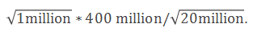
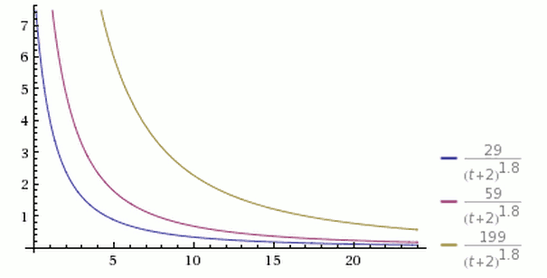

title: CCTime Airdrop FAQ
---

# 1 Introduction of CCTime

CCTime (Cryptocurrency Time) is a Asch’s side-chain technology based sharing and communicating platform for the distributed social news. CCTime is reconstructed from the Hacker News. The block chain technology is used to change the existing pattern of centralized content-sharing market and to solve the difficulties of identification, spreading and making profit with high-quality content. These can make high-quality content was always get paid by a new content value assessment system. Publishers and sharers of high-quality news will be rewarded with tokens according to this “bonus mode”, and this will be beneficial for building a valuable public news gathering and sharing platform. We believe  these will keep with the demands of readers.

# 2 What is CCTime project used for?

CCTime (Cryptocurrency Time) is a sharing and communication platform for the distributed social news, which has the following functions:
Post Article
Post Comment
Vote for Article
Like Comment
report

# 3 How can I know CCTime?

View CCTime offcial website：www.cctime.org
Join CCTime QQ group 1：644658047
Join CCTime QQ group 2：656225495
Download CCTime whitepaper：http://pan.baidu.com/s/1cGqh22
Asch official forum: http://bbs.asch.so.

# 4 Where is the wallet of CCTime and how to download it?
CCTime is a decentralized application based on Asch application SDK, so it can be used for transferring asset with Asch main chain. We will register a publisher in the Asch main chain, named as CCTime, and then use the publisher to register a token, denoted as XCT, which is transferred from Asch main chain. So CCTime and Asch share the wallet , the address of XCT and XAS are interchangeable. Therefore, if you have already downloaded Asch wallet, XCT token will be shown on the asset tab when you transfer XCT token into the wallet.
Online wallet
http://mainnet.asch.so/
Light wallet download address and the user guide:
http://pan.baidu.com/s/1hsh7VDU
Mobile wallet: Android phone can use APP wallet .APP wallet for IOS is on the way, you can use web wallet instead during this time.

# 5 Can I mine XCT token?

We do not use POW algorithm on CCTime, so XCT tokens can’t be mined. But you can gain forging bonus through electing delegate. The rules for delegate are not ready right now, but please keep your eyes on official news for the latest information.

# 6 What is the initial supply of XCT tokens on CCTime platform?

The initial supply of XCT tokens is 10 billion.

# 7 How can I get XCT token?

Instead of ICO, the XCT tokens are free distribution, allowing more people to hold tokens for free. We use airdrop model to distribute XCT tokens and four communities (XAS, BTC, ETH, BTS) can join the project at present. Participants must transfer your tokens that support airdrop to your relevant wallet and bind it to CCTime official website after 20, Aug. The airdrop duration can last one year, XCT tokens will be distributed to participants after snapshots on 20th in every month since September. CCTime is the first DAPP on Asch, so XAS tokens holder can receive more XCT tokens. The distribution coefficient for XAS is 2 and for other tokens is 1.

# 8 When will CCTime be listed on exchange platforms?

CCTime will be online exchange platform after the first airdrop over.

# 9 Don’t  understand the formula in CCTime whitepaper?

The system will decide the distribution number of XCT tokens according to the number of each kind tokens and the participants automatically. The effect factor is dynamical, so we can’t  know the number of XCT distributed to each participant. The following is one example.
For example:
if we have 20 million XAS, 20 million ETH, 200 million BTS to participate in airdrop on the snapshot day. We suppose the total number for XAS, ETH, BTS is 100 million, 100 million, 2 billion, so the percentage participating the airdrop is 20%, 20%, 10%.
If the number of XCT in the first airdrop is 1 billion, the total number the XAS community will receive is 400 million, which is 1 billion*2/5=400 million.
Then we calculate the number of XCT distributed to each participant in XAS community. In order to let more people join the airdrop and prevent the majority XCT being held by the minority rich people, we use square root to distribute XCT evenly.
If you participate the airdrop with 1 million XAS, you can receive .

# 10 The recent schedule

Publish CCTime whitepaper and F&Q, 7th, August, 2017.
Show CCTime on the fourth international block-chain meeting and publish the official website, 16th, August, 2017.
Airdrop begins, 20th, August, 2017. Formally bind the address, count the number
The public beta version of CCTime, anyone give suggestion or submitted BUG will be rewarded with the XCT token, 21th, August, 2017.
Snapshot and distribute XCT to the participants, 20th, September, 2017.
Publish the formal DAPP, 25th, September, 2017.
Publish the mobile APP, 21th, September, 2017.

# 11 What algorithms are used in CCTime?
Cryptography algorithm:
Block ID and transaction ID use the sha256 hash algorithm.
The signature of the bookkeeper and the transaction signature of the block are the sodium implementation version of the ed25519 algorithm.
The master password is several (multiples of 12) word mnemonic symbol generated by the bip39 protocol . The public key pair and the private key pair is based on the master password as seed, and calculated by ed25519 elliptic curve algorithm.Account ID or account address then is encoded by the public key, followed by two sha256 hashes and one ripemd160 hash,repassBase58check.
The following is pseudo code:
1. var secret = bip39Random()
2. var keypair = ed25519.createKeyPair(secret)
3. var privateKey = keypair.privateKey
4. var address = base58check(ripemd160(sha256(sha256(keypair.publicKey))))

# 12 News ranking algorithm
CCTime uses the following comprehensive scoring algorithm:

Where,
-V presents the number of votes obtained by an article; votes are measured in tokens of XCT
-T presents the time from which an article is published (in hours),plus 2 is in consideration of that it takes time to create an article from authoring it to sharing it with the CCTime system, it also avoids the problem that the denominator is too small due to the short releasing time.
-G is a gravity factor, it determines the rate of decline in the article ranking, the default value for CCTime is 1.8.

As can be seen from the Figure above, three posts are published at the same time; the voting number is 199, 59 and 29, which is shown in yellow, purple and blue. We can see the yellow curve is always on the top and the blue one is always on the bottom.
If we keep other condition invariable, the post is newer, the rank is higher, which means the rank of a post can decrease as time going on.
As can be seen from the Figure above, all post have a point less than 1 after 24 hours, which means they will fall to the bottom, so we can guarantee the top are the latest posts.

As can be seen from the figure above, all the parameters of the three curves are the same except that G values, which is 1.5, 1.8 and 2.0 respectively. The higher G value induced the steeper curve  with faster ranking drops. This result indicate that the ranking is updated faster.