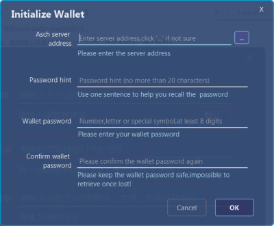
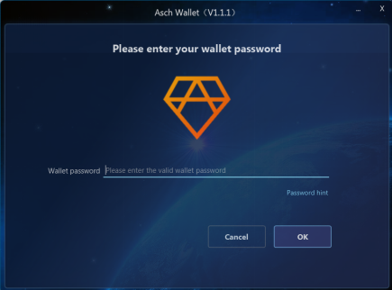
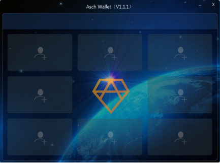
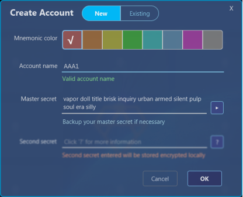
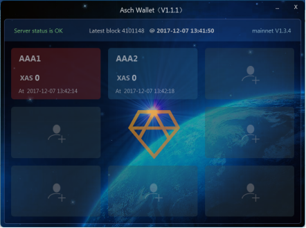
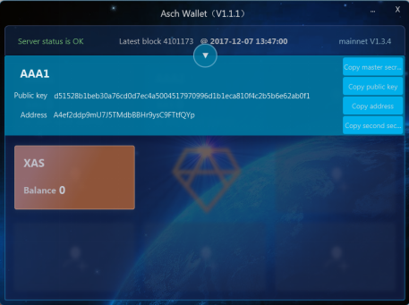
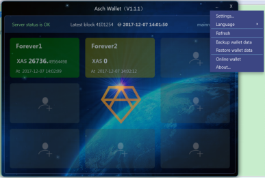

title: Operation Manual of New Asch Wallet
---

# Launch the wallet

Download the package file of the wallet, open it and double-click asch-wallet.exe;

According to the tips on the pop-up “Initialize Wallet” page, input the server address manually or select one address after clicking the ellipsis button, and create a password for the wallet, then click “OK” to get started;

Input the password you just set, enter the wallet;

Click the plus sign on the main interface to record new or existing accounts, 8 accounts as maximum for now;
Create a  new account
Click the plus sign, select “New” and choose a mnemonic color in the pop-up window, which will also become the background color of the new created account on the main interface. Input an account name and save the master secret (if unsatisfied, click the  button to generate a new one, please safely back up your master secret since it cannot be retrieved if lost), then click the “OK” button. Now a new account is successfully recorded to the wallet.

Record an existing account
Click the plus sign, select “Existing” with a mnemonic color (which will also be the background color of the account) in the pop-up window, input an account name and the master secret of the existing account, the second secret is optional; click the “OK” button and then the account is successfully recorded;

View account
Click the recorded accounts on the main interface to check the detailed information;
In the pop-up window, you can click the “” button to return to the main interface;
The four buttons on the right side of the pop-up window have corresponding functions, through which you can copy the master secret, public key, account address and the second secret from top to bottom;

Transfer operation
The balances of all assets (XAS and other assets) are shownon the page of the account information, click the corresponding token to do the transfer operation;
Enter the receiving address (incorrect receiving address will cause permanent loss of the transferred assets), transfer amount and transfer memo(optional), click the “Transfer” button to confirm the operation;to transfer assets between accounts within the wallet, click the ellipsis button next to the receiving address to quickly select one;

A double confirm window will pop up after you clicked the “Transfer” button, make sure everything is right and click “OK” to complete the transfer;
The same process as XAS transfer, every asset transfer will cost 0.1 XAS as the handling charge;
There is an ellipsis button on the upper-right corner of the main interface, all setup functions can be seen by clicking it, which include settings, refresh, backup wallet data, restore wallet data, etc.

Settings
Click the ellipsis button and select “Settings” to enter the setup interface of the wallet, the wallet password is required here; this page is the same as the initialization page, in which you can reset the server address and the wallet password;
Refresh
Click the ellipsis button and select “Refresh” to refresh the page, the major role of this function is to manually refresh the balance of the account and other information after transfer operation;
Backup wallet data
Click the ellipsis button and select “Backup wallet data”, there will be a window poping up, select the location you want and click “OK” to backup your wallet data;
Restore wallet data
Click the ellipsis button and select “Restore wallet data”, select the wallet backup file and click “OK”, reload the wallet according to the prompt message, enter the password to re-login to the wallet and then the wallet data is restored;
Online wallet
This button will lead you to the online wallet page;
About Asch wallet
Introduction and version information of Asch wallet;

