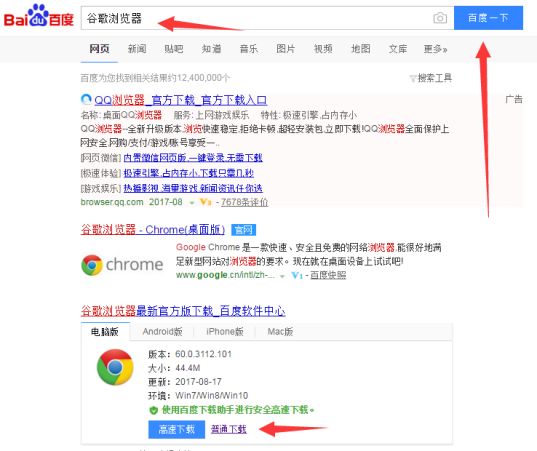

title: CCTime Airdrop FAQ
---

# 1 1.When open the web page, I can not generate the binding address as clicking on the “获取”button?

t is the browser compatibility issue, use Google Chrome can avoid this problem. It is suggested to use Google Chrome to participate in the airdrop.

# 2 What is the CCTime airdrop official website? Which coins can be used to airdrop?

The official website is: https: //www.cctime.org.
There are four kinds of coins can be used: XAS / BTC / BTS / ETH

# 3 Coins on the exchange platform can be used for the airdrop?

No, these four kinds of coins must be transferred to your wallets to participate in the airdrop.

# 4 What is the meaning of binding address of airdrop? Why need I to transfer to the binding address?

binding address is used for the official to statistics who will participate in the airdrop, click “获取”button, the web will randomly generate the binding address of different coins, next you transfer a small amount of coins to the binding address with your wallet, then you can prove that you are the owner of this wallet private key, this step is called binding. It is aimed to prevent someone else to impersonate your wallet address to get the airdrop coin.

# 5 Why should I write my receiving address in the transfer note when use BTS?

Due to the special account system of the Bitshare, the note can be easy to confirm the address of the airdrop.

# 6 Why will the same address binding multiple times be on the blacklist?

multiple binding may lead to the final repeat of the airdrop, It is unfair to the other participants, so we decided to pull the same address binding multiple times to the blacklist, please bind only once.

# 7 What does XCT receive address mean?

XCT receiving address means the address to receive the airdrop XCT. the XCT receiving address is Asch wallet address actually, if you have a non-digital address of the Asch wallet (ie: address is the letter) , you fill the alphabet address of the Asch wallet directly.

# 8 What does the XCT address automatically generated mean?

It means that the system will generate an Asch wallet address when you do not have an Asch wallet, , which has a main password and address, you need to keep it carefully, you cannot enter the wallet when you lose the main password.

# 9 Do I need to bind address if I lock position? I need to lock position until when?

XCT wallet has lock position, system will automatically make the record the first time airdrop happen, there is no need to bind the process, and it will take infect until the 9/20 snapshot, so you must lock to that time at least. Unlocked and unbounded in the 9/20 snapshot are deemed to be automatically discarded.

# 10 How does the original old address (digital address) participate in the airdrop?

binding step is the same with the letter address in the airdrop process, but XCT address shall be automatically generated, and save the main password, then use the original old address (digital wallet address) to transfer a small amount of coin to the binding address, it is OK now。

# 11 Solution to the repeated binding or blacklist

Solution 1: lock to September 20th, let the system make the record automatically.
Solution 2: Transfer coin to anew wallet and re-bind.

# 12 When can I query the binding results?

The result will refresh at 6 pm every day.

# 13 what shall I do when the following error message appears?

If Invalid timestamp errors appear frequently, you need to synchronize your local time.
For more information: [see the forum course](http://bbs.asch.so/topic/23/%E9%92%B1%E5%8C%85%E7%94%A8%E6%88%B7%E9%A1%BB%E7%9F%A5)

# 14 What is the lock position? What is the height of the lock position?

Lock position means that you can not make a transfer transaction until the block height you set. The height can be calculated by yourself, according to produce a block in 10 seconds, one day will have 8640 block, the existing block height (such as the figure the last block height is 3225682) + lock days X 8640 will be the Lock height, input a lock position height, the system will show the lock time point, if you think the time is OK, input the block height.

# 15 How many coins do I need to transfer to the binding address?

The amount is recommended to less than 0.1 (for example, you can transfer 0.01 XAS, 0.01BTS, 0.0001 BTC, 0.001 ETH), but your own wallet balance must be at least 1 XAS, 1 BTS, 0.0001 BTC, 0.001ETH, and the coin you transfer will not return。

