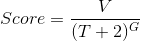
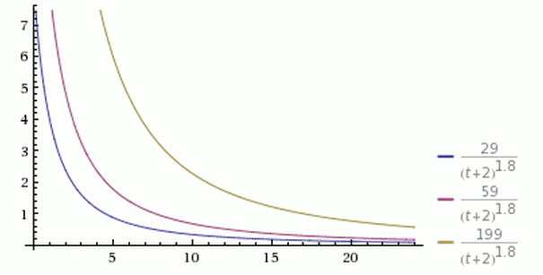

title:  CCTime Whitepaper
---
# 0 Introduction

CCTime (Cryptocurrency Time) is a distributed social news sharing and communication platform based on Asch’s side-chain technology. CCTime is reconstructed based on the Hacker News. The blockchain technology is used to change the existing pattern of a centralized content-sharing market and to solve the difficulties of identification, spreading and making  a profit with high-quality content. Creators of high-quality content will always get paid by a new content value assessment system. Publishers and sharers of high-quality news will be rewarded with tokens according to this “bonus mode,” and this will allow us to build a valuable public news gathering and sharing platform, which will keep up with the demands of readers.

# 1 Why To Make CCtime

## 1.1 Conceptual Origin

CCTime (Cryptocurrency Time) is a demonstrational example of Asch’s applications. The conceptual origin comes from the Hacker News. CCTime only has some simple functions, including account registration and login, press release, browsing, commenting, voting and so on. The core concept of this design is not making original content, copyright protection or social interactions, instead it is content sharing, making comments, and building a lightweight news gathering platform based on blockchain technology.

With the development of this project, we believe that this project has great potential; the main reasons are::

1.CCTime is the first project which mainly aims at news sharing and making comments based on blockchain technology;

2.There are considerable numbers of high-level participants in the crypto market, but there are no high-quality communities such as Hacker News to gather  high-quality users. CCTime will be the answer, and the crypto market will also need this product;

3. When compared with traditional news platforms, on the new CCTime platform, the difficulties of high-quality content identification will be solved effectively by adding a token incentive function.

4.Based on  blockchain technology, the CCTime platform is designed to return the value to the content creators and deliverers, and while all participants can share this cost, no single company is able to control most of it any more;

5.The projects YOYOW, DECENT and GitBook pay more attention to making original content and copyright protection, while CCTime is a content sharing and commenting platform;_a sort of news release platform. Its competitors are  Jinritoutiao and flipboard. When compared with Jinritoutiao, CCTime’s ranking algorithm avoids the bias deepened problem brought by the machine learning algorithm since the machine will only recommend your favorite content;

6.The functions of  CCTime are simple and easy to use. Users can get started quickly;

7.Today, fast reading is becoming a trend. There is more demand for news applications, and the market is looking very promising.

## 1.2 Business model

Centralized content distribution platforms have all the power concentrated in_central institutions, which leads to over-centralization of institutional control. Meanwhile,  completely decentralized content distribution platforms may be full of vulgar content, pornography, reactionary speeches, etc., since there is no regulation.

The concept of CCTime (Cryptocurrency Time) is to spread the value of information. Therefore, to reduce, avoid or even eliminate the negative impact of  total  decentralization, CCTime system uses a regulatory model, combined in a variety of ways.

In the early days, the trustees, as regulators, supervise the CCTime platform through joint reporting. Regulator rights will be supervised by users in order to avoid any abuse of power. Later, each publisher will use the “collateral message” mechanism to publish information. The system will rank the content according to the collateral issue via the collateral XCT.

Readers can comment on content. When a certain level is reached, the publisher can redeem the token, or leave it to the system as a “bargaining chip” for the next round of information sharing.

Through data analysis of the CCTime system, the collateral rate will decrease accordingly.

# 2 Design Concept

## 2.1 Simplicity

CCTime only includes the functions of account registration and login, publishing press releases, browsing, commenting  and voting. It doesn’t focus on advertising social, copyright or original content.

## 2.2 Effective Supervision

Regulators have the supervising roles to review inappropriate contents such as pornography, reactionary, violence, homicide, etc). In the meanwhile, regulators are supervised by other non-regulator users to avoid power abuse.

## 2.3 Free distribution

The tokens can be freely distributed, allowing more people to hold tokens.

## 2.4 Sharing Value

Distributed value transmission breaks the limitation of conventional information on the internet. Everyone enjoys CCTime’s value-added profit distribution by receiving tokens, effectively promoting content publishers’ enthusiasm and improving the production and dissemination of high-quality content.

# 3 Technical Detail

## 3.1 Asset production

CCTime is a decentralized application based on Asch’s application SDK. The CCTime application will not issue tokens independently by transferring from the main chain. A publisher called CCTime in the Asch main chain will be registered, and the publisher will be used to register an asset called XCT, which is known as cctime.xct. Once the asset is issued, it will be transferred to the CCTime application in a lump sum and will be locked in a joint signature account of the application. We will release 95 percent of tokens by airdropping within one year to users who are interested in the application.

Why not produce assets within CCTime?

Issuing assets in the main chain are reliable. In the future, the assets transferred to Dapp can also be transferred to the main chain through the cross-link port and then transferred to other applications，achieving the goal of multi-chain and multi-purpose.

## 3.2 System of account

The main chain of Asch is in normal use with all the accounts of Dapp (except for the old version of the digital address). Account authentication uses asymmetric encryption techniques. Therefore, there is no need for a centralized registration process. The user only needs to keep the master password corresponding to an account, can make various write operation on the blockchain, such as transfer, release news, reward, praise, comment and so on.

The master password uses the bip39 protocol generated by several (multiples of 12) word mnemonic symbols, as well as the public key pair and the private key pair taking the master password as seed, calculated by the ed25519 elliptic curve algorithm. Account ID or account address then is encoded by the public key, followed by two sha256 hashes and one ripemd160 hash, and a repass Base58check.

## 3.3 Cryptography algorithm

Block ID and transaction ID use the sha256 hash algorithm.

The signature of the bookkeeper and the transaction signature of the block are the sodium implementation version of the ed25519 algorithm.

## 3.4 Contract and abstract transaction model

The Asch application uses an abstract transaction model; this model can represent any function call. On the Bitcoin blockchain, the payload of the block is a transaction or transfer record, In Asch applications, the payload of the block is the function or contract call, also called an affair(transaction). A transaction can modify multiple states such as balances, nicknames, news, comments, etc.

CCTime includes the following specific methods:
1. postArticle (Release news)
2. postComment (Release comment)
3. voteArticle (Vote for the article)
4. likeComment (Reward for the comment)
5. report (Reporting articles or comments)

## 3.5 News ranking algorithm
CCTime uses the following comprehensive scoring algorithm:

Thereinto,

V stands for the number of votes obtained by an article; votes are measured in tokens of XCT .

T stands for the time from which an article is published (in hours), Plus 2 is in consideration because it takes time to create an article from authoring it to sharing it with the CCTime system, it also avoids the problem that the denominator is too small due to too short release time.

G is a gravity factor ,it determines the rate of decline in the article ranking, the default value for CCTime is 1.8

As shown in the picture above, there are three simultaneous posts, respectively scoring 199, 59 and 29, which is respectively in yellow, in purple and in blue. At any point in time, the yellow curve is at the top, the blue curve at the bottom.

Provided that other conditions are the same, the more newly published posts, the higher the ranking. In other words, the ranking of a post will fall as time goes on.

What is possible to see on the picture above is that all posts have a score less than 1 after 24 hours. That means they will fall to the bottom of the list, ensuring that the top ones will be new.

As it can be seen in the figure above, the other parameters of the three curves are the same. G values are 1.5, 1.8 and 2.0 respectively. The higher the G value, the steeper the curve, the faster the ranking drops, Which means that the ranking is updated faster.
(This section refers to the Yifeng Ruan’s blog, and is slightly modified)

## 3.6 Reward Mechanism
The execution of each transaction requires the consumption of basic fees, which are paid by the sponsor and distributed equally to all accounts.

In addition to the basic fee, postArticle and postComment, the sponsor also needs to choose to spend extra tokens to represent the amount of votes and quotas, which are mostly rewarded to the publisher of the articles or the commenter publishers, but a small number (10%) will enter into the expense pool to be assigned to the accountant.

## 3.7 Review Mechanism
CCTime is a decentralized system, without user authentication. The user generally logs in anonymously. There is a need for a review mechanism to prevent anti-government, anti-social or other violations of the law of the emergence of speech.

The review of CCTime 1.0 is temporarily responsible by all the delegates. Each delegate can report any articles or comment. If the content is reported more than 3 times, the article or comment will be filtered out, but will not be deleted from the underlying database;it will be just marked. The review mechanism only affects the data returned by the query interface. A non-standard node compatible with the CCTime protocol can still show all non-filtered data.

# 4 Distribution Mechanism
XCT (current coin) issues a maximum of 10 billion coins. The main team reserves 5% tokens, and the remaining 95% will be airdropped to the blockchain community.

## 4.1 Distribution Principle
The principle of distribution is to cover as many user groups as possible, mainly for crypto users/investors, and it can also cover the ones who do not know much about the cryptocurrency.

## 4.2 Formula（MCDF）

## 4.3 Staging Airdrop Rules

### 4.3.1 First Round of Airdrop Rules

1. 1.Only for the four communities in coin circle (Asch coin, Bitcoin, Ethereum, BitShares);

2. Use the multi-community allocation rule in section 5.2;

3. The XCT token airdrop was originally planned to be on August 20, and postponed due to new regulations. A snapshot of the four public chains will be taken, and the user’s share will be calculated according to the formula, and the tokens will be distributed immediately ;
1)Distribution of 1 billion tokens in total;
2)Refer to Appendix A for examples.

### 4.3.2 After the second period

Starting from the second period, The one who is holding XCT (current coin) can participate in the airdrop, in addition to the specified coins. Each XCT (current coin) can receive 0.1 XCT (current coin). Program of other coins and airdrop ratio is to be determined.

# 5 Competition Advantages

CCTime (Cryptocurrency Time) is the first Dapp application (decentralized content distribution platform) based on Asch’s system side-chain, which has a commanding advantage over other platforms such as Steem, Synereo, Decent, PressOne, specifically:

1. Own the support of Asch’s technology and community;
2. Product model innovation, market segments without competitors;

# 6 Risk Tips

Although the distribution model of CCTime (Cryptocurrency Time) makes use of airdrops,  each round of airdrops, and the increasing number of visitors will inevitably bring a risk of speculation, including but not limited to:

1. Secondary trading market has formed. Offline trading becomes active and highly risky;

2. XCT (current coin) once distributed, the authority no longer holds. The holder is the owner. The key should be properly preserved. Once lost, the authority will not shoulder responsibility;

3. CCTime (Cryptocurrency Time) is an application of distributed content sharing and communication, which is based on the Asch system. As a platform application, participants should abide by the relevant laws and regulations, prohibit all bad, reactionary and other remarks, together to create a safe atmosphere.

# 7 More Attention
The Asch team is adhering to the concept of blockchain sharing and contribution. After a long period of research and development, they are about to share the first application of Asch’s ecology to the domestic blockchain community. Everyone is welcome to use it, and we invite the majority of the blockchain developers to join the Asch community. Everyone may promote the application of China’s blockchain to participate in the CCTime (Cryptocurrency Time) airdrop. For more information, please pay attention to upcoming announcements on the following channels：

CCTime official website: www.cctime.org

ASCH official website: www.asch.io

Official weibo: Beijing Asch Chain Technology Co., Ltd.

ASCH Official Wechat Public Subscribe

Official QQ group：

CCTime official group1：644658047

CCTime official group2：65622549

#8 Appendix A: XCT (Current Coin) First Round Airdrop Examples

For example, if the total number of Asch coins to participate in airdrop is 40 million (XAS) this round, and the weighting factor of Asch is 2, the Asch coin is calculated as 100 million (XAS) in total.
The proportion of Asch coin:
Pxas = Xxas * Kxas / Sxas = 40 million * 2/100 million = 0.8
If total number of Bitcoin to participate in airdrop is 5 million（Xbtc） this round and the weighting factor of Bitcoin is 1, the Bitcoin is calculated as 20 million（Sbtc） totally.
The proportion of Bitcoin:
Pbtc = Xbtc * Kbtc / Sbtc = 5 million * 1/20 million = 0.25
If total number of Ethereum to participate in airdrop is 50 million（Xeth） this round and the weighting factor of Ethereum is 1, the Ethereum is calculated as 100 million（Seth） totally.
The proportion of Ethereum:
Peth = Xeth * Keth / Seth = 50 million * 1/100 million = 0.5
If total number of Bitshare to participate in airdrop is 1 billion（Xbts） this round and the weighting factor of Bitshare is 1, the Bitshare is calculated as 2.5 billion（Sbts） totally.
The proportion of Bitshare:
Pbts = Xbts * Kbts / Sbts = 1 billion * 1 / 2.5 billion = 0.4
A total airdrop amount of Asch coin earned:
Gxas = DPxas / Pxas + Pbtc + Peth + Pbts = 1 billion * 0.8 / (0.8 + 0.25 + 0.5 + 0.4) = $ 410 million
A total airdrop amount of Bitcoin earned:
Gbtc = DPbtc / Pxas + Pbtc + Peth + Pbts = 1 billion * 0.25 / (0.8 + 0.25 + 0.5 + 0.4) = 128 million
A total airdrop amount of Ethereum earned:
Geth = DPeth / Pxas + Pbtc + Peth + Pbts = 1 billion * 0.5 / (0.8 + 0.25 + 0.5 + 0.4) = 256 million
A total airdrop amount of Bitshare earned:
Gbts = DPxas / Pxas + Pbtc + Peth + Pbts = 1 billion * 0.4 / (0.8 + 0.25 + 0.5 + 0.4) = 205 million

If the user j holds one percent (400,000)of Asch coin（Txasj）, the number of CCTime he can get is:
Uxasj= 100million
If the user j holds one percent (50,000)of Bitcoin（Tbtcj）, the number of CCTime he can get is:
Ubtcj= 100million
If the user j holds one percent (500,000)of Ethereum（Tethj）, the number of CCTime he can get is:
Uethj= 100million
If the user j holds one percent (10million)of Bitshare（Tbtsj）, the number of CCTime he can get is:
Ubtsj= 100million