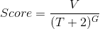
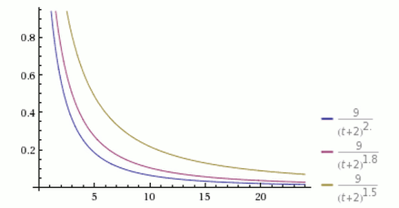

title: CCTime问答
---

# 1 请简单介绍下CCTime

CCT（Cryptocurrency Time）是基于阿希（Asch）侧链技术开发的分布式社会新闻分享与交流平台。CCT在Hacker News的基础上进行改进，使用区块链技术改变现有中心化的内容市场格局，解决优质内容难以识别、传播和变现的问题，通过全新的内容价值评价体系保证优质内容的生产者直接获得收益。通过区块链“打赏模式”给优质新闻发布者、分享者，让参与者享受优质内容的同时也能够获得相应的“打赏”，构建一个有价值且符合大众的新闻聚合和内容分享平台。

# 2 CCTime是项目是做什么的？

CCTime是分布式社会新闻分享与交流平台，主要包括以下具体事务：
postArticle 发布文章(新闻)
postComment 发布评论
voteArticle 给文章投票
likeComment 打赏评论
report 举报文章或评论

# 3 我可以在哪里了解到CCTime？

CCTime生态社区1群：644658047
CCTime生态社区2群：656225495
CCTime官网：www.cctime.org

# 4 CCTime钱包在哪？哪里可以下载

CCT是基于Asch应用sdk开发的去中心化应用，与Asch主链可以互通资产，我们会在Asch主链注册一个叫做CCtime得发行商，然后使用这个发行商注册一个名为XCT的发行代币，代币来自主链的转入。所以CCT的钱包即为阿希钱包，XCT的地址与XAS的地址通用。用户只需下载使用阿希钱包即可，如将XCT转入阿希钱包，XCT代币会在资产栏显示。

在线钱包：
http://mainnet.asch.so/
轻钱包下载地址以及钱包注册与使用：
http://pan.baidu.com/s/1hsh7VDU
移动端钱包：安卓手机使用Android版APP钱包 ，苹果手机IOS版本后续会加上，请暂时使用web版本。

# 5 CCTime可以挖矿吗？

CCTime采用非Pow算法，因此不能挖矿，但可以通过参选受托人来获取锻造收益。目前受托人规则要求尚未设定好，请持续关注CCtime官方动态。

# 6 CCTime平台的XCT代币初始发行量为多少？

XCT的初始发行量为100亿枚。

# 7 我如何才能够得到XCT代币？

不进行ICO，代币全部进行免费分发，让更多的人可以免费持有代币。采用空投的模式，目前暂支持四种虚拟币：阿希币，比特币，以太坊以及比特股，参与者须将支持空投的币种提至各钱包内，并与CCTime官网进行绑定，绑定地址8月20日开启。空投期为一年，自9月起，每月20日快照分发XCT代币。（一年空投为总量的85%，对于CCTime的贡献者奖励为总量的10%，团队仅预留总量的5%）基于CCTime是在阿希上的第一个DAPP应用，为了特别感谢阿希的支持者，分配时阿希的持有者将会分到更多的XCT，阿希的系数为2，其他币种的系数为1。

# 8 CCTime什么时候上线交易平台？

CCTime会在第一期空投结束后上线交易平台进行交易。

# 9 CCTime白皮书里面的公式看不懂？

系统会根据各币的数量，以及参与人数来定最后具体可以分发到多少的CCT数额。由于是动态的调整，目前无法知晓可以对应领取多少XCT，公式举例如下：
公式举例：
1. 假设快照当日共有2000万xas、2000万eth、2亿bts参与空投XCT，即。
2. 假设xas、eth、bts的总币量为1亿、1亿、20亿，那么币社区关联币量占币总发行量的比例为20%、20%、1%。（2：2：0.1）
3. 第一期空投XCT数量为10亿，该社区能够在此次空投中获取的总币量，如xas可获得10亿*2/5=4亿XCT。
4. 根据xas社区总参与量4亿计算个人获取的XCT数量，即。但是，为了让更多人能够公平参与，减少大户能够大量持有XCT，我们采用，即统一对开根号，这样能够更均匀的分散XCT，对未来市场造成影响，
5. 假设张三作为用户，他此次参与空投的xas数量为100万个，那么他最终获得的数量=4亿*/（每个空投者的总和）。

# 10 有没有近期进程安排？
具体时间进度安排：
2017.8.3 CCTime发布准白皮书及F&Q
2017.8.7 CCTime发布正式版白皮书
2017.8.16 CCTime亮相2017第四届区块链国际峰会并公布官网
2017.8.20 开始空投，正式绑定地址，统计数量
2017.8.21 公测版CCTime，公测提出建议或提交BUG的可获得代币XCT，最终按照比1：1兑换
2017.9.20 快照并分发XCT到参与者的阿希钱包
2017.9.21 发布正式版DAPP
2017.9.25 发布移动端APP

# 11 CCTime相关算法有哪些？

密码学算法：
区块id与交易id使用的是sha256 hash算法
区块的记账人签名与交易签名使用的是ed25519算法的sodium实现版

主密码是使用bip39协议生成的由若干个(12的倍数)单词组成的助记符，而公私钥对是以主密码为种子，通过ed25519椭圆曲线算法计算得到账户id或账户地址则是由公钥通过两次sha256哈希以及一次ripemd160哈希再经过base58check进行编码获得。
以下是伪代码：
var secret = bip39Random()
var keypair = ed25519.createKeyPair(secret)
var privateKey = keypair.privateKey
var address =
base58check(ripemd160(sha256(sha256(keypair.publicKey))))

新闻排名算法：
CCT使用了如下的综合评分算法：

其中，
V表示一篇文章获得的投票数，投票数以代币XCT来计量
T表示距离发布文章的时间(单位为小时)，加上2是考虑到一篇文章从创作出来至分享到CCT系统需要一定的时间，也避免了由于发布时间过短导致分母太小的问题
G是一个重力因子，它决定了文章排名下降的速度，CCT使用的默认值为1.8

从上图可以看到，有三个同时发表的帖子，得票分别为 199 票、59 票和 29 票，分别以黄色、紫色和蓝色表示。在任一个时间点上，都是黄色曲线在最上方，蓝色曲线在最下方。
在其他条件不变的情况下，越是新发表的帖子，排名越高。或者说，一个帖子的排名，会随着时间不断下降。
从上图可以看到，经过 24 小时之后，所有帖子的得分基本上都小于 1，这意味着它们都将跌到排行榜的末尾，保证了排名前列的都将是较新的内容。

从上图可以看到，三根曲线的其他参数都一样，G 的值分别为 1.5、1.8 和 2.0。G 值越大，曲线越陡峭，排名下降得越快，意味着排行榜的更新速度越快。

